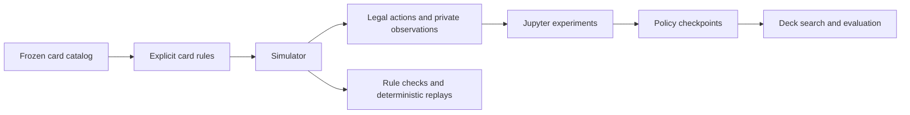

# Hearthstone Learning Lab

A side quest that got out of hand: build a Hearthstone simulator, then use it to explore how a player can learn the game and how decks can evolve.

The interesting part is everything underneath the model. Hearthstone has hidden information, thousands of card interactions, generated cards, persistent effects, and choices that interrupt other choices. This project builds those rules explicitly so that future learning experiments have a game they can trust.

**Work in progress.** The goal is the complete frozen Standard format across all 11 classes. The simulator is still being built; training is run manually in Jupyter.

## What is here

- An explicit rules engine with legal actions, private player observations, resumable effects, combat, and deterministic replays.
- A frozen catalog of **1,185 Standard cards**, pinned to patch **36.6.0.251952** and September 18, 2026.
- An experimental learning interface with action features, policy updates, saved checkpoints, and resumable runs.
- A deck-search workflow that compares legal candidate decks using frozen policies and separate evaluation seeds.
- Jupyter notebooks for inspecting the simulator, checking rules, recording games, and running your own experiments.



## Current progress

| Component | Status |
| --- | --- |
| Standard card implementations | 890 of 1,185 connected to the development candidate |
| Generated historical cards | 229 explicit bodies; generation-pool completion is separate |
| Shared interactions and client fidelity | In progress; passing local checks does not establish complete game fidelity |
| Training and deck search | Code and notebooks available for manual experiments on supported cards |

The [current candidate status](staging/rebased-88/STATUS.md) records validation evidence. The [completion queue](docs/engine-audit/completion-queue.md) tracks unfinished cards and dependencies. Unsupported behavior raises an error rather than being silently approximated.

## Try it locally

```sh
git clone https://github.com/mlanning-builds/hearthstone-learning-lab.git
cd hearthstone-learning-lab
python3 -m venv .venv
source .venv/bin/activate
python -m pip install -r requirements.txt
python -m jupyterlab notebooks/09_candidate_random_validation.ipynb
```

On Windows, activate the environment with `.venv\Scripts\activate` instead. Preserve the repository layout: the candidate uses a relative link to the shared frozen data. Python 3.9.6 is the currently observed local environment; cross-platform setup remains under review.

Start with notebook **09** to inspect coverage and validate random games without learning. Notebook **13** runs the shared-rule checks. When you choose to train, notebook **11** lets you set the budget and start the run yourself. Notebooks **12** and **14** compare and search decks with saved policies.

Training is never started by installation, imports, or continuous integration. Local runs and model files remain under ignored `runs/` directories.

## Explore the code

| Path | Purpose |
| --- | --- |
| [`staging/rebased-88/expanded/`](staging/rebased-88/expanded/) | Current all-class development candidate |
| [`notebooks/`](notebooks/) | Interactive simulator and experiment workflows |
| [`tools/`](tools/) | Validation, recording, training, and deck-search runners |
| [`data/standard/`](data/standard/) | Frozen card catalog and provenance |
| [`docs/engine-audit/`](docs/engine-audit/) | Dependency inventories, reviewed behavior, and unresolved fidelity gaps |
| [`engine/`](engine/) and [`learner/`](learner/) | Preserved original Death Knight experiment |

The candidate folder's name is historical. The older root simulator and notebooks are retained for provenance; use notebooks 09–14 for current candidate work. The [project guide](PROJECT_GUIDE.md) has detailed workflows and experiment boundaries.

## Where this is going

Complete the remaining card effects and generated dependencies, validate shared interactions against independent evidence, and make the simulator easy for other people to use. Then run larger learning and deck-search experiments in Jupyter with explicit budgets and reproducible reports.

Contributions are welcome. Start with [CONTRIBUTING.md](CONTRIBUTING.md) and the [roadmap](docs/ROADMAP.md). Changes should include a meaningful rules scenario and preserve hidden-information boundaries and deterministic replay.

## License and data

Project source code is available under the [MIT license](LICENSE). Frozen third-party card data and game content retain their original rights and are excluded from that source-code license; see [NOTICE](NOTICE). This is an unofficial fan project, with no Blizzard affiliation.
